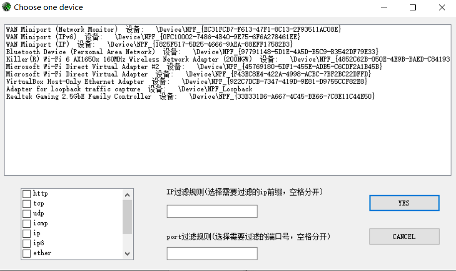
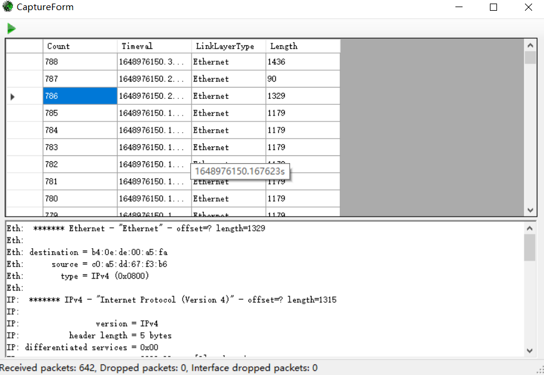
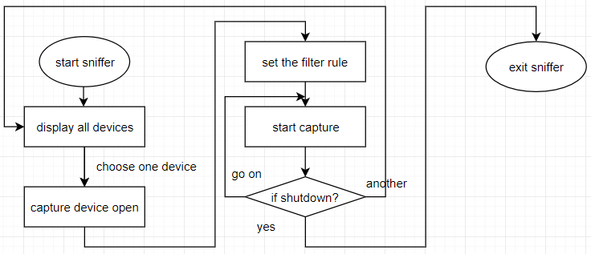

## my sniffer:

This is just to finish the course work that I haven't been to once
This project is a simple package capture based on the example given by sharppcap.It's not very technical, because I haven't been to this class, right.However, I will have a more in-depth understanding of network protocol and packet capture technology when I have time later.

### 1. Environment:
1. .Net Framework 4.8
2. [Sharppcap](https://github.com/dotpcap/sharppcap)
3. windows10  killer® Wi-Fi 6 AX1650X

### 2. result:

